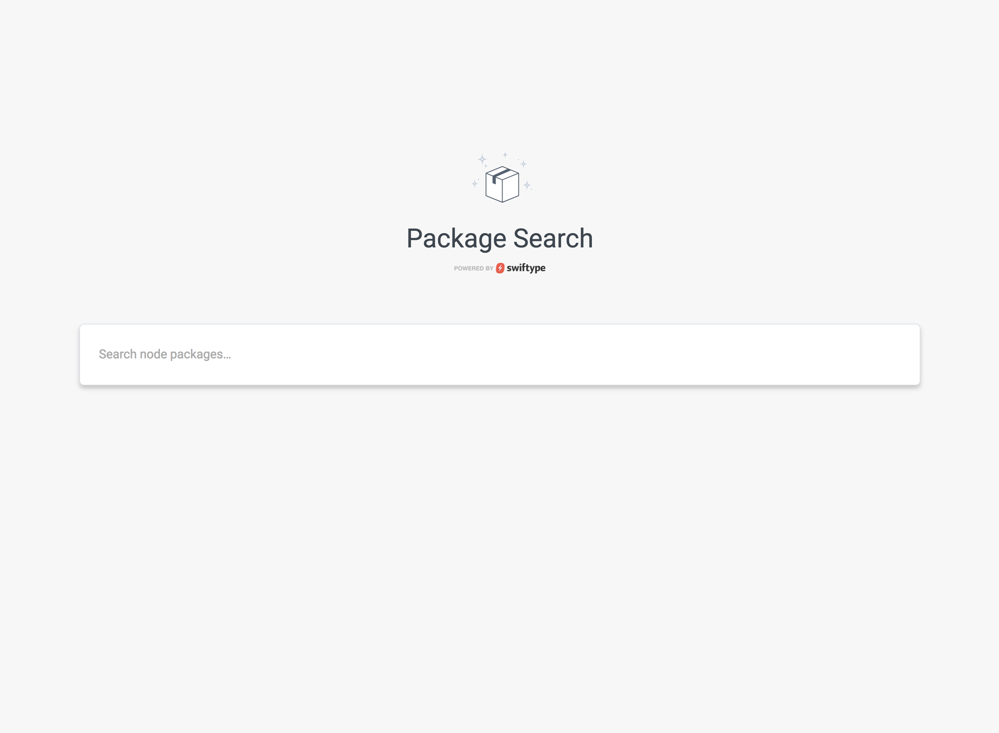

# App Search React Demo

This is the robust, fully featured React App Search demo. The demo allows the visitor to search through ~9500+ `node-modules`. This README is a continuation of the _article_ - pull down the `starter` branch to work from scratch. The `solution` branch will help you wrap up the tutorial, while this README will help you extend it into a truly useful search experience.

This README is broken down into the following sections:

* [Setup](#setup) - Follow these instructions to run the example search application.
* [Topics](#topics) - Considerations when building a React-based search application.



## Setup

To get started, simply clone this repository and run `npm` to install dependencies. We will go over some basic configuration steps, but if you are coming from the tutorial you can skip to [State Management](#state).

```
# Clone the repository
git clone git@github.com:swiftype/app-search-demo-react.git
cd app-search-demo-react

# Install dependencies
npm install
```

### Create an Engine in App Search

Before setting up this project, you will need to create a new Engine on App Search. For best results, name your Engine `node-modules`. Specific instructions explaining how to do this can be found in the [Getting Started](https://swiftype.com/documentation/app-search/getting-started#sign-up) guide, Steps 1 & 2.

To enable Search, you will need to retrieve three credentials from your App Search account. You can find them within the dashboard [Credentials](https://app.swiftype.com/as/credentials) menu.

Create a `.env` file at the root of this project using the following format:

```bash
# .env

REACT_APP_HOST_IDENTIFIER=<Host Identifier goes here, prefixed with `host-`>
REACT_APP_API_KEY=<Your Private API Key, prefixed with `private-`>
REACT_APP_SEARCH_KEY=<Your Public Search Key, prefixed with `public`>
```

You can then consume them directly by looking them up in `process.env.<name>`.

```javascript
const client = SwiftypeAppSearch.createClient({
  accountHostKey: process.env.REACT_APP_HOST_IDENTIFIER,
  apiKey: process.env.REACT_APP_SEARCH_KEY,
  engineName: "node-modules"
});
```

### Push data to the `node-modules` Engine

This project does not have a back-end API or database as many projects would. Instead, it pulls objects into a JSON file and then ingests them directly into App Search for indexing
using the [swiftype-app-search-node](https://github.com/swiftype/swiftype-app-search-node) client.

```bash
# Index data from data/node-modules.json into the node-modules Engine
yarn run index-data
```

If you return to your Engine's Dashboard, you should now see the indexed documents. Once there, you'll need to define types for your Schema. By default, everything should be of type `Text`, which is correct for the most part. The only thing you'll need to do is change the two date fields, `created` and `modified`, to `Date` types.

### Run the search app

At this point, your engine is ready and all that is left to do is run the application:

```bash
npm start
```

### State Management [#state]

In the React ecosystem, there are many solutions for State Management. Any solution you choose will work with Swiftype; be it Redux, Mobx, or whatever else. Regardless of what you pick, here are a couple of guidelines to help.

#### Manage your search state in the url

A good search front-end will have stateful urls that are shareable and navigable with browser back and forward buttons. This is relatively simple to implement with the [React Router](https://github.com/ReactTraining/react-router), which is what we chose to use in this example. The other package you'll see us use is [query-string](https://github.com/sindresorhus/query-string), which is a simple query string parser, which react-router lacks out of the box.

We want to save our state in the query string - as opposed to a hash fragment - so, we use the `BrowserRouter`.

Additionally, we need access to the values in our search query. We do not want to access the browser `location` object directly, so we also include a `Route` component, which exposes this to us. Since we only have 1 route in our application, we do not configure a path match on it. Instead, we use the Route to get access to the `location` object.

Our `Route` component also exposes the `history` object, which will allow us to update the URI in reaction to user inputs.

`BrowserRouter` actively detects changes to the URI, so any time we use `history.pushState` to push new search selections to the URI, the props will change on our application, forcing a re-render. This means that we can implement our search queries in `componentDidMount` and `componentDidUpdate`.

In other words, if we were managing state in local component state, we would be managing state like this:

```javascript
// Update state
this.setState({
  query: "search term"
});

// Read from state
console.log(this.state.query);
// 'search term'
```

In our case, instead of managing state in local component state, we're simply lifting it up to the url, so we just use a slightly modified pattern:

```javascript
// Update state
this.props.history.pushState(
  queryString.stringify({
    query: "search term"
  })
);

// Read from state
console.log(queryString.parse(this.props.location.search).query);
// 'search term'
```

Here is a simple example of what it looks like all put together:

```javascript
// index.js

import { BrowserRouter as Router, Route } from "react-router-dom";
import App from "./App.js"

...

<Router>
  <Route>
    {({ location, history }) => (
      <App location={location} history={history} />
    )}
  </Route>
<Router>


// App.js


state = {
  results: null
}

handleOnChange(e) {
  const query = e.target.value;
  this.props.history.pushState(
    queryString.stringify({
      query: "search term"
    })
  );
}

updateResults() {
  const query = queryString.parse(this.props.location.search).query;
  fetchResults().then(results => {
    this.setState({
      results
    })
  })
}

componentDidMount() {
  updateResults();
}

componentDidUpdate() {
  if (this.props.location.search !== prevProps.location.search) {
    updateResults();
  }
}

render() {
  return (<div>
    <input
      type="text"
      value={queryString.parse(this.props.location.search).query}
      onChange={this.handleOnChange} />
    {this.props.results.map(result => (
      // Results go here...
    ))}
  </div>)
}
```

#### Centralize your search state and logic

Using a central store is a smart decision for a search interface. Search screens often require data in many different disconnected pieces of the view, like totals, paging, filters, etc... Having this data in one central store is very clean and ensures data is accessible by all of these pieces.

You may choose to use something like Redux or Mobx, either being a good choice. For our application, we chose to use a single, high-level component to manage our store and actions. See [Search.js](src/Search.js).

This is a simplistic approach that encapsulates all search actions and state. It uses the Render Props pattern (https://reactjs.org/docs/render-props.html) to pass these actions and state down to individual components in the UI.

For example:

```javascript
<Search>
  {({ query, searchActions, searchResults }) => (
    <div>
      <Totals {...searchResults.pageState} />
      <SearchBox query={query} onChange={searchActions.updateQuery} />
      <Filters
        filters={searchResults.filters}
        onChange={searchActions.updateFilters}
      />
      <Results results={searchResults.results} />
      <Paging
        {...searchResults.pageState}
        onPageChange={searchActions.updatePage}
      />
    </div>
  )}
</Search>
```

### Implementing a search box

There's no magic involved in creating a search box for App Search. For the best experience, a "live" search
box is often the best choice.

By "live", we simply mean a search box that reacts to user input "live" as a user types. That could be something like we have in our example, where we are showing the results in the page body below the search box. Or, it could be something like a type-ahead search box. In either case, the approach is the same...

1.  Create an input box that implements an `onChange` handler and shows the current query value

    ```javascript
    export default function SearchBox({ query, onChange }) {
      return <input type="text" value={query} onChange={onChange} />;
    }
    ```

2.  Add a [central Search store](#centralize-your-search-state-and-logic), to house your query logic

    ```javascript
    <Search>
      {({ query, searchActions }) => (
        <div>
          <SearchBox query={query} onChange={searchActions.updateQuery} />
        </div>
      )}
    </Search>
    ```

3.  Render your results somewhere!

    Again, that could be in the page body:

    ```javascript
    <Search>
      {({ query, searchActions, results }) => (
        <div>
          <SearchBox query={query} onChange={searchActions.updateQuery} />
          <Results results={results} />
        </div>
      )}
    </Search>
    ```

    Or it could be part of an autocomplete, rendered in your SearchBox

    ```javascript
    <Search>
      {({ query, searchActions, searchResults }) => (
        <div>
          <SearchBox
            query={query}
            onChange={searchActions.updateQuery}
            results={searchResults.results}
          />
        </div>
      )}
    </Search>
    ```

#### Type-ahead

There are many popular "auto-complete", or "type-ahead" components for React that you may be able to use with Swiftype. We have not evaluated them for use yet, but any Component that implements a stateless interface that allows you to pass in everything as props as we do above should work well.

### Paging

Pagination details are stored in the meta details in server responses. These details can easily be fed to most pagination components, like [rc-pagination](https://www.npmjs.com/package/rc-pagination), which we find to be flexible and work well with App Search.

See [Pagination.js](src/Pagination.js)

Note: The App Search API currently only supports up to 100 pages, so be sure to limit your pagination component to show no more than 100 pages.

### Filtering

Filtering lets us further refine search query results. Our approach, as discussed in the [State Management](#state-management) section, is to store all search state in the url.

For example, in the following URI, we are querying by the term "express", and then filtering the results to include only packages that have "node" listed in their "dependencies", and a "license" of "MIT".

```
http://localhost:3000/?q=express&dependencies=node&license=MIT
```

In [Search.js](src/Search.js), we then read those from the url and include them as an option in our Search API call:

```
filters: {
  all: {
    dependencies: "express",
    license: "MIT"
  }
}
```

Once that is in place, you should be able to manually add filters to your search string and see the results change. The only thing left to do, then, is actually implement code to update the filter state in the url.

We do this through two components, which are simple wrappers around React Router's [Link](https://reacttraining.com/react-router/web/api/Link) component.

[FilterLink](src/FilterLink.js)

```javascript
// This simply creates a link with `dependencies=node` appended to the query string
<FilterLink name="dependencies" value="node" queryState={queryState}>>
```

[RemoveFilterLink](src/RemoveFilterLink.js)

```javascript
// This simply creates a link with `dependencies=node` removed from the query string
<RemoveFilterLink name="dependencies" value="node" queryState={queryState}>>
```

Using these custom Link components lets us apply filters declaratively from anywhere in our UI.

### Faceted Search

Faceted Search takes the idea of filtering one step further. In our example app, we decided to show three Facet filters, `license`, `keywords`, and `dependencies`. In order to get the details needed to build these filters, including values and counts, we simply passed some additional search options in our query in [Search.js](src/Search.js).

```json
"facets": {
  "license": {
    "type": "value",
    "size": 10
  },
  "keywords": {
    "type": "value",
    "size": 10
  },
  "dependencies": {
    "type": "value",
    "size": 10
  }
}
```

This in turn gives us all the information we require to build the Faceted Search navigation in the left hand-side of the screen. From there, we use our `FilterLink` and `RemoveFilterLink` components from the [Filtering](#filtering) section to turn the values into links.

The code for this can be found in our [Facets](src/Facets.js) component.

Note that our implementation is simplistic. Other things you might consider including are:

* The ability to select more than one filter value
* Having a "Show more" button so that you can see more than the first 10 Facet values

There are many more options for Facets, be sure to check out the full set of options in the docs!

### Click Through Tracking

Use the [click](https://github.com/swiftype/swiftype-app-search-javascript#click-through-tracking) method available
in the JavaScript Client.

In our implementation, we do the following:

1.  Create a `trackClick` action in [Search.js](src/Search.js), which calls `client.click`.
2.  Add an `onClick` handler to individual result items, which calls `trackClick` with the corresponding result ID. See [Results.js](src/Results.js).

For more information click through tracking and analytics, see the [documentation](https://swiftype.com/documentation/app-search/api/clickthrough).

### That's it!

Have fun! We hope this has been useful in helping you explore building search within React.
