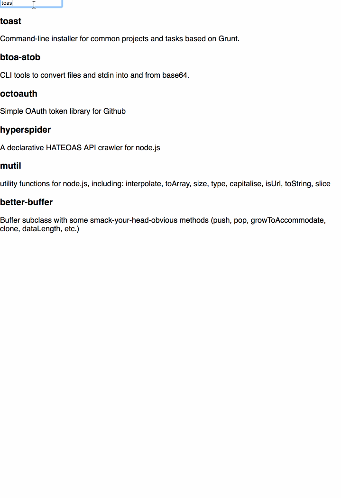

# App Search React Example

This example demonstrates how to build a React based search interface using Swiftype's App Search.

This README is broken down into the follow section:

* [Setup](#Setup) - Follow the instructions in the section below to run the Example app.
* [React Quick Start](#React-Quick-Start) - Build your own basic React app in a few simple steps.
* [Topics](#Topics) - Considerations for building a React based search app.

## Setup

To get started, simply clone this repository and run yarn to install dependencies.

```
# Clone the repository
git clone git@github.com:JasonStoltz/react-app-search-demo.git
cd react-app-search-demo

# Install dependencies
yarn
```

### Create an Engine in App Search

Before setting up this project, you will need to create a new Engine on [Swiftype App Search](https://swiftype.com/app-search). Name it `node-modules` (this is important).

You'll then need to configure this project to point to your newly created Engine, so create a `.env` file at the root of this project using the following format:

```
REACT_APP_HOST_KEY=
REACT_APP_API_KEY=
REACT_APP_SEARCH_KEY=
```

From within the Engine Dashbord, navigate to "Access > API Keys". Enter the "Account Host Key", "api-key", and "search-key" values from that screen as values in the `.env` file, respectively.

### Push data to the `node-modules` Engine

This project doesn't have a backend API or database as many projects would. Instead, it simply pulls documents from a JSON file, and indexes them directly into App Search
using the [swiftype-app-search-node](https://github.com/swiftype/swiftype-app-search-node) client. This JSON file doesn't
exist yet, so the first thing to do is download that data file.

```
yarn run init-data
```

If that ran succesfully, a `data/node-modules.json` file should now exist. Now index the data you've downloaded into your App Search Engine:

```
yarn run index-data
```

If you return to your Engine's Dashboard, you should now see the indexed documents. Once there, you'll need define types for your Schema. By default, everything should be Text, which is correct for the most part. The only thing you'll need to is change the two date fields, `created` and `modified`, to `Date` types.

### Run the search app

At this point, your engine is ready and all that is left to do is run the app.

```
yarn start
```

This app primarily uses [swiftype-app-search-javascript](https://github.com/swiftype/swiftype-app-search-javascript) to query our new Engine and renders the results.

### React Quick Start

Getting a React front-end up and running for App Search is dead simple. Here are a few quick steps to create basic front-end of your own:

1.  Set up and populate an Engine. To do so, just pull this repo down and follow the instructions in [Setup](#Setup).

2.  Create a new app with `create-react-app`

```bash
yarn global add create-react-app
create-react-app node-module-search
```

3.  Add the App Search Javascript Search Client:

```bash
cd node-module-search/
yarn add swiftype-app-search-javascript
```

4.  Configure your app with your App Search credentials. The steps are listed in [Setup](#Setup). The same `.env` file will work here, but note that since we're only querying, not indexing, you won't need your write privledged API key, just the Host and read-only Search key will do.

```
# .env

REACT_APP_HOST_KEY=<key goes here>
REACT_APP_SEARCH_KEY=<key goes here>
```

4.  Replace `App.js` with the following:

```javascript
# src/App.js

import React, { Component } from "react";
import * as SwiftypeAppSearch from "swiftype-app-search-javascript";

const client = SwiftypeAppSearch.createClient({
  accountHostKey: process.env.REACT_APP_HOST_KEY,
  apiKey: process.env.REACT_APP_SEARCH_KEY,
  engineName: "node-modules"
});

class App extends Component {
  state = {
    query: "",
    results: null
  };

  componentDidMount() {
    this.updateResults(this.state.query);
  }

  handleChange = e => {
    const query = e.target.value;
    this.setState(
      {
        query
      },
      () => {
        this.updateResults(query);
      }
    );
  };

  updateResults = query => {
    client
      .search(query, {
        search_fields: {
          name: {},
          description: {}
        },
        result_fields: {
          id: { raw: {} },
          name: {
            raw: {}
          },
          description: {
            raw: {}
          }
        }
      })
      .then(
        resultList => {
          this.setState({
            results: resultList
          });
        },
        error => {
          console.log(`error: ${error}`);
        }
      );
  };

  render() {
    const { query, results } = this.state;
    if (!results) return null;
    return (
      <div className="App">
        <input type="text" value={query} onChange={this.handleChange} />
        {results.results.map(result => (
          <div key={result.getRaw("id")}>
            <h3>{result.getRaw("name")}</h3>
            <div>{result.getRaw("description")}</div>
          </div>
        ))}
      </div>
    );
  }
}

export default App;
```

5.  Run your new search app

```
yarn start
```

At this point, you should have a fully functioning, ableit simple, React based interface for your App Search Engine. Huzzah!



Don't stop there though. Review the example code and some of the [Topics](#Topics) listed below to scale your search app.

## Topics

### Indexing your data

### Accessing your data

#### Managing API credentials

### State Management

#### Managing URL State

### Searching

### Showing Results

### Paging

### Filtering

### Click through tracking

### Testing

```

```
