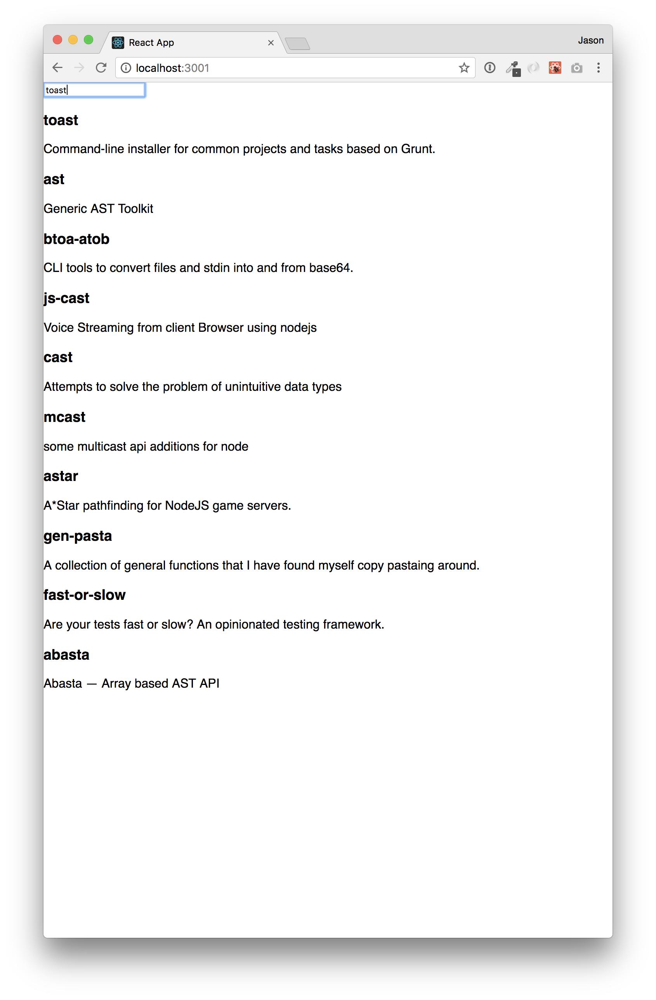

# App Search React Example

This example demonstrates how to build a React based search interface using Swiftype's App Search.

This README is broken down into the follow sections:

* [Setup](#setup) - Follow these instructions to run the Example search app.
* [React Quick Start](#react-quick-start) - Build your own basic React app in a few simple steps.
* [Topics](#topics) - Considerations when building a React based search app.

## Setup

To get started, simply clone this repository and run yarn to install dependencies.

```
# Clone the repository
git clone git@github.com:JasonStoltz/react-app-search-demo.git
cd react-app-search-demo

# Install dependencies
yarn
```

### Create an Engine in App Search

Before setting up this project, you will need to create a new Engine on [Swiftype App Search](https://swiftype.com/app-search). Name it `node-modules` (this is important).

You'll then need to configure this project to point to your newly created Engine, so create a `.env` file at the root of this project using the following format:

```
REACT_APP_HOST_KEY=
REACT_APP_API_KEY=
REACT_APP_SEARCH_KEY=
```

From within the Engine Dashbord, navigate to "Access > API Keys". Enter the "Account Host Key", "api-key", and "search-key" values from that screen as values in the `.env` file, respectively.

### Push data to the `node-modules` Engine

This project doesn't have a backend API or database as many projects would. Instead, it simply pulls documents from a JSON file, and indexes them directly into App Search
using the [swiftype-app-search-node](https://github.com/swiftype/swiftype-app-search-node) client. This JSON file doesn't
exist yet, so the first thing to do is download that data file.

```
yarn run init-data
```

If that ran succesfully, a `data/node-modules.json` file should now exist. Now index the data you've downloaded into your App Search Engine:

```
yarn run index-data
```

If you return to your Engine's Dashboard, you should now see the indexed documents. Once there, you'll need define types for your Schema. By default, everything should be Text, which is correct for the most part. The only thing you'll need to is change the two date fields, `created` and `modified`, to `Date` types.

### Run the search app

At this point, your engine is ready and all that is left to do is run the app.

```
yarn start
```

## React Quick Start

Getting a React-based front-end up and running for App Search is dead simple. Here are a few quick steps to create a basic front-end of your own:

1.  Set up and populate an Engine. To do so, just pull this repo down and follow the instructions in [Setup](#setup).

2.  Create a new app with `create-react-app`

```bash
yarn global add create-react-app
create-react-app node-module-search
```

3.  Add the App Search Javascript Search Client:

```bash
cd node-module-search/
yarn add swiftype-app-search-javascript
```

4.  Configure your app with your App Search credentials. The steps are listed in [Setup](#setup). The same `.env` file will work here, but note that since we're only querying, not indexing, you won't need your write-privledged API key, just the Host and read-only Search key will do.

```bash
# .env

REACT_APP_HOST_KEY=<key goes here>
REACT_APP_SEARCH_KEY=<key goes here>
```

4.  Replace `App.js` with the following:

```javascript
// src/App.js

import React, { Component } from "react";
import * as SwiftypeAppSearch from "swiftype-app-search-javascript";

const client = SwiftypeAppSearch.createClient({
  accountHostKey: process.env.REACT_APP_HOST_KEY,
  apiKey: process.env.REACT_APP_SEARCH_KEY,
  engineName: "node-modules"
});

class App extends Component {
  state = {
    query: "",
    results: null
  };

  componentDidMount() {
    this.updateResults(this.state.query);
  }

  handleChange = e => {
    const query = e.target.value;
    this.setState(
      {
        query
      },
      () => {
        this.updateResults(query);
      }
    );
  };

  updateResults = query => {
    client
      .search(query, {
        search_fields: {
          name: {},
          description: {}
        },
        result_fields: {
          id: { raw: {} },
          name: {
            raw: {}
          },
          description: {
            raw: {}
          }
        }
      })
      .then(
        resultList => {
          this.setState({
            results: resultList
          });
        },
        error => {
          console.log(`error: ${error}`);
        }
      );
  };

  render() {
    const { query, results } = this.state;
    if (!results) return null;
    return (
      <div className="App">
        <input type="text" value={query} onChange={this.handleChange} />
        {results.results.map(result => (
          <div key={result.getRaw("id")}>
            <h3>{result.getRaw("name")}</h3>
            <div>{result.getRaw("description")}</div>
          </div>
        ))}
      </div>
    );
  }
}

export default App;
```

5.  Run your new search app

```
yarn start
```

At this point, you should have a fully functioning, ableit simple, React based interface for your App Search Engine. Huzzah!



Don't stop there though. This app is super simple and it won't get your very far. Review the example code and some of the [Topics](#topics) listed below to scale this up to meet your needs.

## Topics

### Indexing your data

Generally speaking, indexing data (i.e. the process of populating your Engine with documents, or data) is outside the purview of a React App. You'll likely implement that as part of your backend API. However, you can see an example of how this might be accomplished using the [Node.js client](https://github.com/swiftype/swiftype-app-search-node) in this example's [index-data.js](./scripts/index-data.js) script.

For more information, visit the Swiftype App Search [documentation](https://swiftype.com/documentation/app-search/guides/indexing-documents).

### Accessing your data

You effectively have two options for accessing data from a React app.

1.  Access the data through your own API, which queries your Engine on the backend.
2.  Access the data through Swiftype's API, querying data directly in the front end using the [swiftype-app-search-javascript](https://github.com/swiftype/swiftype-app-search-javascript) client.

Typically, you'll want to go with option 2, and query Swiftype's API directly from the front-end. Swiftype's App Search API
is highly optimized, so querying directly should give you the fastest search experience. This example app takes that approach.

#### Configuring your search app with API credentials

In order to use the Javascript client, you'll need to configure it with credentials. Here are a few approaches you might consider:

1.  Configuration at build time

    This is the approach this example application uses. It reads the API credentials you provide at build time from `.env`, and
    includes them as part of the built Javascript bundle. This is convenient as `create-react-app` has a mechanism built in for that, [out of the box](https://github.com/facebook/create-react-app/blob/master/packages/react-scripts/template/README.md#adding-custom-environment-variables). The drawback of this approach is that the built bundle is environment specific, so you couldn't use the same bundle in multiple environments.

2.  Configuration at run time

    An alternate approach would be configuring these environment variables as part of your host application, server side, and then passing them in through data attributes in the DOM:

    ```html
    <div data-host-key="your_key_here" data-search-key="your_key_here" id="search" />
    ```

    The advantage of this, is that your built bundle could now be deployed to multiple environments, with different configuration.

3.  Configuration through proxy

    This approach would involve proxying API requests through your own API, which adds the appropriate authentication Headers. This would typically be implemented in order to hide your API key from public view, however, as long as you are using a read-only API key this should be unnecessary.

### State Management

In the React ecosystem, there are many solutions for State Management. Any solution you choose will work with Swiftype; be it, Redux, Mobx, or whatever else. Regardless of what you pick, here are a couple of guidelines to help.

#### Manage your search state in the url

A good search front-end will have stateful urls that are shareable and navigable with browser back and forward buttons. This is relatively simple to implement with [React Router](https://github.com/ReactTraining/react-router), which is what we chose to use in this example. The other package you'll see us use is [query-string](https://github.com/sindresorhus/query-string), which is a simple query string parser, which react-router lacks out of the box.

We want to save our state in the query string (as opposed to a hash fragment), so we use the `BrowserRouter`.

Additionally, we need access to the values in our search query, and we don't want to access the browser `location` object directly, so we also include a `Route` component, which exposes this to us. Since we only have 1 route in our App, we don't configure a path match on it, we simply use the Route to get access to the `location` object.

Our `Route` component also exposes the `history` object, which will allow us to update then url in reaction to user inputs.

`BrowserRouter` actively detects changes to the url, so any time we use `history.pushState` to push new search selections to the url, the props will change on our app, forcing a re-render. This means that we can simply implement our search queries in `componentDidMount` and `componentDidUpdate`.

In other words, if we were managing state in local component state, we'd be managing state like this:

```javascript
// Update state
this.setState({
  query: "search term"
});

// Read from state
console.log(this.state.query);
// 'search term'
```

In our case, instead of managing state in local component state, we're simply lifting it up to the url, so we just use a slightly modified pattern:

```javascript
// Update state
this.props.history.pushState(
  queryString.stringify({
    query: "search term"
  })
);

// Read from state
console.log(queryString.parse(this.props.location.search).query);
// 'search term'
```

Here's a simple example of what it looks like all put together:

```jsx
// index.js

import { BrowserRouter as Router, Route } from "react-router-dom";
import App from "./App.js"

...

<Router>
  <Route>
    {({ location, history }) => (
      <App location={location} history={history} />
    )}
  </Route>
<Router>


// App.js


state = {
  results: null
}

handleOnChange(e) {
  const query = e.target.value;
  this.props.history.pushState(
    queryString.stringify({
      query: "search term"
    })
  );
}

updateResults() {
  const query = queryString.parse(this.props.location.search).query;
  fetchResults().then(results => {
    this.setState({
      results
    })
  })
}

componentDidMount() {
  updateResults();
}

componentDidUpdate() {
  updateResults();
}

render() {
  return (<div>
    <input
      type="text"
      value={queryString.parse(this.props.location.search).query}
      onChange={this.handleOnChange} />
    {this.props.results.map(result => (
      // Results go here...
    ))}
  </div>)
}
```

#### Centralize your search state and logic

Using a central store is a smart decision for a search interface. Search screens often require data in many different disconnected pieces of the view (think totals, paging, filters, etc.), so having this data in one central store is very clean and ensures data is accessible by all of these pieces.

You may choose to use something like Redux or Mobx, which would be excellent choices. For our app, which is fairly simple, we chose to simply use a single, high-level component to manage or store and actions. See [Search.js](src/Search.js). This is a simplistic approach, that simply encapsulates all search handlers and data. It uses the Render Props pattern (https://reactjs.org/docs/render-props.html) to pass these actions and data down to invididual components in the UI.

ex.

```jsx
<Search>
  {({ query, results, filters, pageState, updatePage, updateQuery, updateFilters }) => (
    <div>
      <Totals {...pageState}>
      <SearchBox query={query} onChange={updateQuery} />
      <Filtes filters={filters} onChange={updateFilters} />
      <Results results={results} />,
      <Paging {...pageState} onPageChange={updatePage} />
    </div>
  )}
</Search>
```

### Implementing a search box

There's no magic involved in creating a search box for App Search. For the best experience, a "Live" search
box is often best choice.

By "Live", we simply mean a search box that reacts to user input "live" as a user inputs it. That could be something like we have in our Example, where we are showing the results in the page body below the search box, or it could be something like an autocomplete box. In either case, the approach is the same:

1.  Create an input box that implements an `onChange` handler and shows the current query value

    ```jsx
    export default function SearchBox({ query, onChange }) {
      return <input type="text" value={query} onChange={onChange} />;
    }
    ```

2.  Add a [central Search store](#centralize-your-search-state-and-logic), to house your query logic

    ```jsx
    <Search>
      {({ query, updateQuery }) => (
        <div>
          <SearchBox query={query} onChange={updateQuery} />
        </div>
      )}
    </Search>
    ```

3.  Render your results somewhere!

    Again, that could be in the page body:

    ```jsx
    <Search>
      {({ query, updateQuery, results }) => (
        <div>
          <SearchBox query={query} onChange={updateQuery} />
          <Results results={results} />
        </div>
      )}
    </Search>
    ```

    Or it could be part of an autocomplete, rendered in your SearchBox

    ```jsx
    <Search>
      {({ query, updateQuery, results }) => (
        <div>
          <SearchBox query={query} onChange={updateQuery} results={results} />
        </div>
      )}
    </Search>
    ```

#### Deboucing

Implementing a "live" search box will generate a large volume of requests to the server. To reduce the number of requests sent to the server, it can be useful to implement a `debounce` on your `onChange` handler. We do this using [lodash](https://lodash.com/docs/4.17.10#debounce).

#### Auto-complete

There are many popular "auto-complete", or "type-ahead" components for React that you may be able to use with Swiftype. We haven't evaluated them for use yet, but any Component that implements a stateless interface that allows you to pass in everything as props as we do above should work well.

### Paging

Pagination details are stored in the meta details in server responses. These details can easily be fed to most pagination components, like [rc-pagination](https://www.npmjs.com/package/rc-pagination), which we find to be flexible and work well with App Search.

See [Pagination.js](src/Pagination.js)

### Filtering

### Click through tracking

### Testing
